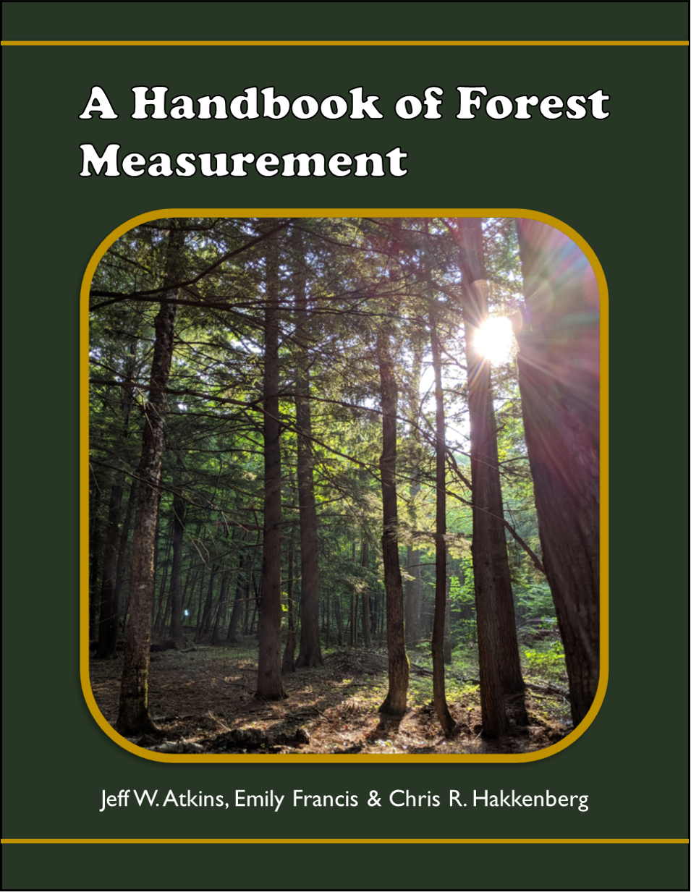

--- 
title: "A Handbook of Forest Measurement"
author: "Jeff W. Atkins, Emily Francis, Chris R. Hakkenberg"
date: "2021-06-04"
output:
  html_document:
    df_print: paged
documentclass: book
bibliography: book.bib
biblio-style: apalike
link-citations: yes
github-repo: atkinsjeff/ForestMeasurements
url: https://atkinsjeff.github.io/ForestMeasurements/
description: A guide to measuring forest structural diversity
site: bookdown::bookdown_site
---

# Preface {-}

This book originated from a collaboration formed during the Forest Structural Diversity Workship in 2020. 
